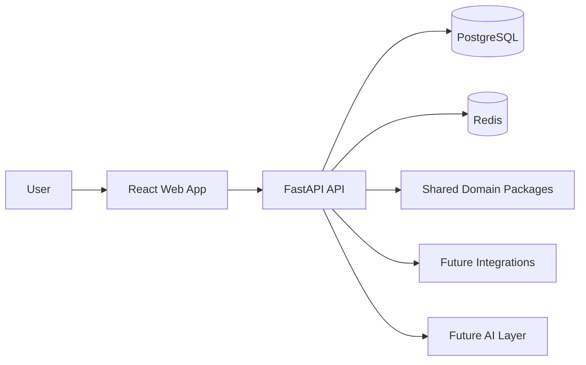

# Component Architecture

Overview of the Internal Sea monorepo and how major parts connect.

## Monorepo overview

```
internal-sea-core/
├── apps/           # Deployable applications
├── packages/       # Shared Python libraries
├── docs/           # Product and technical documentation
├── infra/          # Docker and deployment assets
└── root config     # Compose, Makefile, pyproject.toml, CI
```

Applications depend on shared packages. Business rules and domain types live in packages so the API (and future workers) stay thin.

## Backend app (`apps/api`)

FastAPI application with domain modules under `app/modules/`. Each module follows: `router.py`, `schemas.py`, `service.py`, `repository.py`, `errors.py`.

**Implemented:** Data Products API (`/api/v1/data-products`)

### Future API modules (placeholders created)

| Module | Domain |
|--------|--------|
| `catalog` / `data_products` | Data products (**live**) |
| `work_items` | Work management |
| `projects` / `internal_projects` | Delivery containers |
| `people` / `teams` / `capabilities` | Organization |
| `performance` | Metrics and delivery health |
| `compliance` / `policies` / `rules` | Governance |
| `tools` / `triggers` / `schedules` | Automation |
| `commercial` / `deals` / `pilots` / `mvps` | Pipeline |
| `files` | Attachments and storage |
| `meetings` | Meetings and action items |
| `relationships` / `activity` | Entity links and audit |

Routers are registered only when a module is implemented — placeholders are not exposed in OpenAPI.

## Frontend app (`apps/web`)

React + TypeScript + Vite SPA:

- **App shell** — sidebar, top bar, routed content area
- **API client** — `lib/apiClient.ts` → backend `/api/v1`
- **TanStack Query** — server state (health check, future catalog data)
- **Feature modules** — `src/features/<domain>/` with `api.ts` and `types.ts`
- **Routes** — `/dashboard`, `/data-products`, `/work-items`, etc.

Docker service on port **5173**. Browser calls API at `http://localhost:8000/api/v1`.

## Shared packages

| Package | Role |
|---------|------|
| `core-domain` | Constants, enums, shared business rules |
| `core-db` | SQLAlchemy models, sessions, migrations |
| `core-auth` | Auth helpers, permissions (later) |
| `core-integrations` | Jira, GitHub, Teams, Slack, BI tools (later) |
| `core-ai` | Assistant, context builder, summarization (later) |

## Database

PostgreSQL is the system of record. Redis supports caching, sessions or job queues as needs emerge.

## Future worker

A background worker process is not in scope for Phase 1. When needed, it will:

- Consume jobs from Redis or a queue
- Reuse `core-domain`, `core-db` and `core-integrations`
- Run outside the request path (sync, notifications, AI batch jobs)

## Container diagram



## Request flow (target state)

1. User interacts with the React app in the browser.
2. The web app calls the FastAPI API with JSON over HTTPS.
3. The API validates input, applies auth (later), and uses shared packages.
4. Persistence goes through `core-db` to PostgreSQL.
5. Redis backs ephemeral or fast lookups when introduced.
6. Integrations and AI layers are invoked from the API or worker as features land.

## Design constraints

- Keep apps thin; push reusable logic into packages.
- Avoid premature microservices — one repo, one API, one web app until scale demands otherwise.
- Document new boundaries in [DECISION_LOG.md](DECISION_LOG.md).
