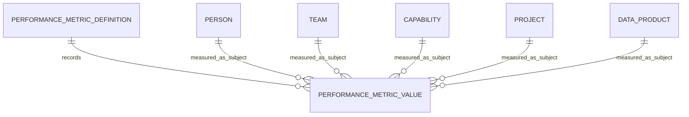
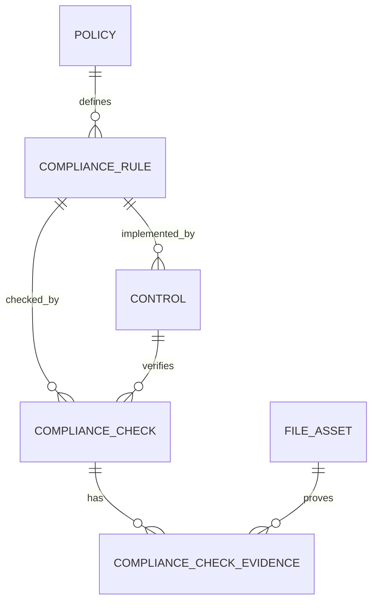
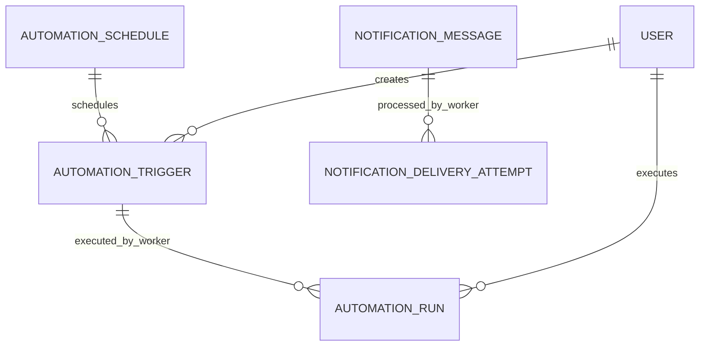
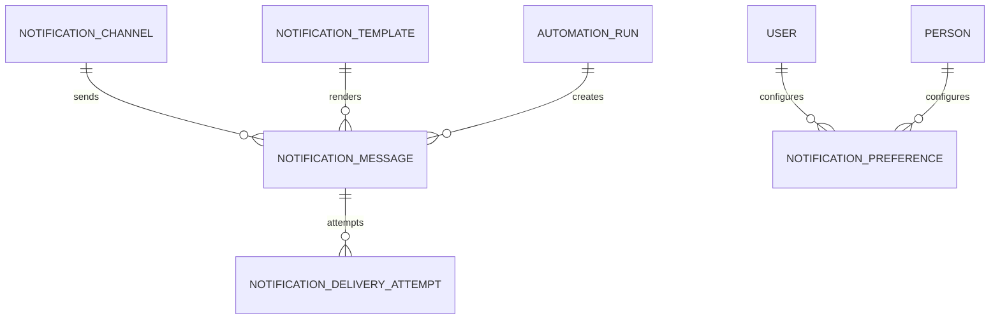
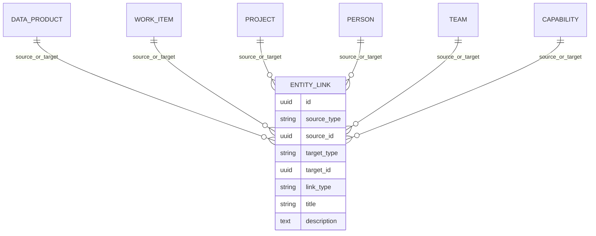
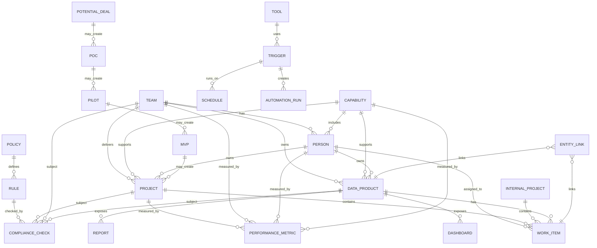
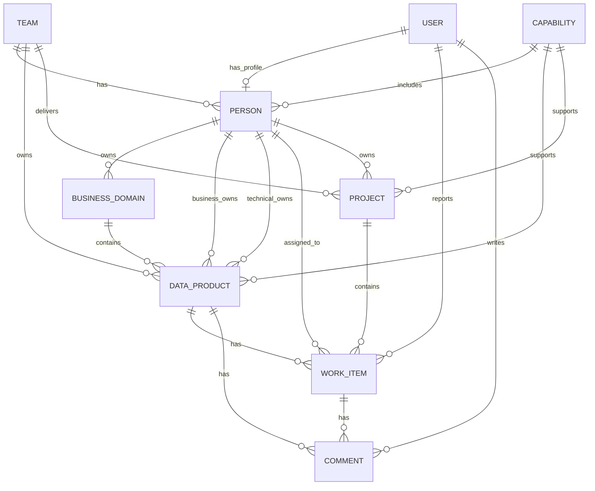
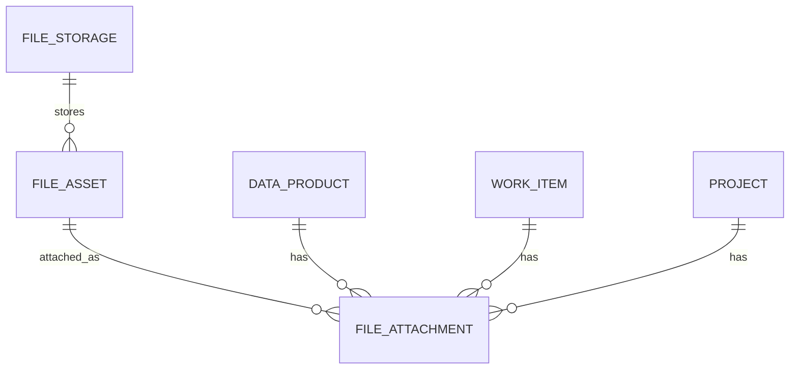

# Data Model

Conceptual and physical data model for Internal Sea. Implemented SQLAlchemy models live in `apps/api/app/models/`. The sections below describe both **implemented** tables and **target** entities for the full operating model.

## Architecture principle

Internal Sea is an **internal operating system** — not only a catalog, not only task management. The core value is the **relationship layer** connecting products, work, people, projects, compliance, performance, tools and commercial pipeline objects.

**MVP implementation:** Data Products (API + UI), Work Items (API + UI), Projects (API + UI), People/Teams/Capabilities (API). Everything else is documented target scope.

---

## Implemented tables (Phase 3–5)

| Table | Model | API |
|-------|-------|-----|
| `system_info` | `SystemInfo` | — |
| `users` | `User` | — |
| `people` | `Person` | **CRUD + deactivate** `/api/v1/people` |
| `teams` | `Team` | **CRUD** `/api/v1/teams` |
| `capabilities` | `Capability` | **CRUD** `/api/v1/capabilities` |
| `business_domains` | `BusinessDomain` | — |
| `data_products` | `DataProduct` | **CRUD** `/api/v1/data-products` |
| `work_items` | `WorkItem` | **CRUD + board** `/api/v1/work-items` |
| `projects` | `Project` | **CRUD** `/api/v1/projects`, `/api/v1/internal-projects` |
| `comments` | `Comment` | **CRUD** nested under data products, work items, projects |
| `activity_events` | `ActivityEvent` | **Read** `/api/v1/activity` |
| `entity_links` | `EntityLink` | **CRUD** `/api/v1/relationships` |
| `file_storages` | `FileStorage` | **CRUD** `/api/v1/files/storages` |
| `file_assets` | `FileAsset` | **CRUD** `/api/v1/files` |
| `file_attachments` | `FileAttachment` | **Attach/detach** `/api/v1/files/attachments` |

### Advanced dashboard (read model)

The advanced dashboard is a **read model over existing tables** — no `dashboard_*` storage tables in MVP.

- Aggregates and health scores are **calculated dynamically** at request time in `app/modules/dashboard/`
- Actionable insights are **deterministic rules** over current row state (not AI-generated)
- Section endpoints query catalog, work, projects, compliance, performance, automation, notifications and activity models directly
- Scores are transparent heuristics documented in `scoring.py` — not official compliance or executive KPIs yet

---

## 1. Catalog and Business Assets

### DataProduct (implemented)

Governed business data asset. Central catalog object.

**MVP note:** `DataProduct.type` represents dashboards, reports, datasets, metrics, KPIs, APIs, AI agents and automations until specialized tables are needed.

| Type values | `dashboard`, `dataset`, `metric`, `kpi`, `api`, `ai_agent`, `report`, `automation`, `data_contract`, `other` |

### Target catalog assets (not yet separate tables)

| Entity | Notes |
|--------|-------|
| **Dashboard** | May stay as `DataProduct.type=dashboard` initially |
| **Report** | `DataProduct.type=report` initially |
| **Dataset** | `DataProduct.type=dataset` |
| **Metric / KPI** | `DataProduct.type=metric` / `kpi` |
| **API** | `DataProduct.type=api` |
| **AI Agent** | `DataProduct.type=ai_agent` |
| **Automation** | `DataProduct.type=automation` |
| **File** | Implemented as `FileAsset` — metadata and external URLs |
| **FileStorage** | Implemented — S3, SharePoint, Azure Blob, external URL, etc. |

Binary upload and cloud provider integration are future scope. MVP stores metadata and external links.

---

## 2. Delivery and Work

### WorkItem (implemented)

Delivery unit: tasks, bugs, risks, decisions, technical debt (via `WorkItem.type`).

**Links:** optional `project_id`, `data_product_id`, `team_id`, `capability_id`, assignee/reporter.

### Project (implemented)

Single `projects` table with `project_type` discriminator:

| Type values | `client_project`, `internal_project`, `poc`, `pilot`, `mvp`, `initiative` |

**Status values:** `idea`, `planned`, `active`, `on_hold`, `completed`, `cancelled`, `archived`

**API views:**
- `/api/v1/projects` — all project types
- `/api/v1/internal-projects` — filtered view where `project_type = internal_project`

Internal projects are not a separate table — they are an API/view over the same model.

**Links:** owner (Person), team, capability; work items via `WorkItem.project_id`.

**Future links:** compliance checks, performance metrics, meetings, deals/opportunities.

### Target work entities

| Entity | Notes |
|--------|-------|
| **Meeting** | Governance, delivery, steering meetings |
| **ActionItem** | Outcomes from meetings |
| **Risk / Decision / TechnicalDebt** | Covered by `WorkItem.type` in MVP |

---

## 3. People and Capability

### Person (implemented)

Represents real team members or planned resources in the operating model.

| Field | Notes |
|-------|-------|
| `full_name` | Required display name |
| `email` | Optional, unique |
| `role_title` | Job or delivery role label |
| `seniority_level` | Enum: intern → partner |
| `team_id` | Primary team (MVP: one team per person) |
| `capability_id` | Primary capability (MVP: one capability per person) |
| `availability_percent` | 0–100 capacity indicator |
| `is_active` | Soft lifecycle flag — DELETE deactivates |

**API:** `/api/v1/people` with search, filters and summary counts (work items, data products, projects).

**Links:** assigned work items, owned data products (business/technical), owned projects.

### Team (implemented)

Delivery grouping for people, projects, data products and work items.

**API:** `/api/v1/teams` with search and summary counts (people, data products, work items, projects).

**Delete:** hard delete only when no references exist.

### Capability (implemented)

Skill or service capability area — e.g. Data Engineering, BI, AI, CloudOps, Data Governance, Product Management.

**API:** `/api/v1/capabilities` with search and summary counts.

**Delete:** hard delete only when no references exist.

### User (implemented, no API yet)

| Model | Table | Notes |
|-------|-------|-------|
| **User** | `users` | Login account (auth later); optional link from Person |

### MVP relationship rules

- Person belongs to **one primary team** and **one primary capability** via foreign keys.
- Later phases may add many-to-many skills and time-based allocations.

### Target (documented, not yet modeled)

| Entity | Notes |
|--------|-------|
| **Skill** | Tag on people |
| **Allocation** | Person capacity assignment over time |
| **Role** | Application role (partially via `User.role`) |

---

## 4. Performance Metrics (implemented — MVP)

| Entity | Purpose |
|--------|---------|
| **PerformanceMetricDefinition** | Defines what is measured (name, code, subject type, direction, targets) |
| **PerformanceMetricValue** | Stores a recorded value for an entity and period |

`PerformanceMetricValue` uses generic `subject_type` + `subject_id` (no hard FKs to every subject table). Supported active subject types: `person`, `team`, `capability`, `project`, `internal_project`, `data_product`. Validation happens in the service layer.

**Scorecard** is a calculated read model (not stored in MVP). It aggregates active definitions and latest values per entity, with simple score, trend and interpretation.

---

## 5. Compliance and Governance (implemented — MVP)

Supports internal governance, delivery governance, security checks, AI usage rules, data quality and project compliance.

| Entity | Purpose |
|--------|---------|
| **Policy** | Governing document with status, owner and effective dates |
| **ComplianceRule** | Checkable rule derived from a policy |
| **Control** | Control framework element under a rule |
| **ComplianceCheck** | Manual evaluation run against a subject |
| **ComplianceCheckEvidence** | Proof file linked to a check (references `FileAsset`) |
| **Exception** | Approved deviation (target) |
| **Approval** | Sign-off record (target) |

`ComplianceCheck` uses generic `subject_type` + `subject_id` (no hard FKs to every subject table). Supported active subject types: `data_product`, `project`, `internal_project`, `team`, `capability`. Future types (`person`, `tool`) exist in the enum but are not validated until implemented.

Evidence links to `FileAsset` via `ComplianceCheckEvidence`. When evidence is added, the service may also create a `FileAttachment` on the subject with `is_evidence=true`.

Automated rule execution, schedules, approvals and policy versioning are **not** in MVP.

---

## 6. Automation (MVP foundation)

| Entity | Purpose |
|--------|---------|
| **AutomationSchedule** | Recurrence definition (`frequency`, `timezone`, `next_run_at`, optional `cron_expression`) |
| **AutomationTrigger** | Condition, action and target binding (`target_type` + `target_id`, `action_config` JSON) |
| **AutomationRun** | Execution history (manual runs in MVP) |

`target_type` / `target_id` are generic references validated in the service layer (no hard FK to domain tables).

Safe MVP action types: `create_work_item`, `add_comment`, `create_activity_event`, `send_notification` (simulation only).

### Worker execution (MVP foundation)

The optional background worker uses existing automation and notification tables. PostgreSQL remains the source of truth; no external queue in MVP.

| Mechanism | Purpose |
|-----------|---------|
| `AutomationTrigger.next_run_at` | Due schedule trigger discovery |
| `AutomationTrigger.locked_*` | Simple row lock to prevent duplicate execution |
| `AutomationRun.worker_instance_id` | Which worker instance created the run |
| `NotificationMessage.status=queued` | Worker-eligible notification queue |
| `NotificationMessage.locked_*` | Lock while a message is being processed |
| `NotificationDeliveryAttempt.worker_instance_id` | Which worker processed delivery |

Real external notifications, webhooks, AI actions and complex cron parsing remain **future scope**.

## 6a. Notifications (implemented — MVP foundation)

| Entity | Purpose |
|--------|---------|
| **NotificationChannel** | Channel configuration (`channel_type`, `status`, optional `endpoint_url`, non-secret `provider_config`) |
| **NotificationTemplate** | Simple placeholder templates (`subject_template`, `body_template`) |
| **NotificationPreference** | Per-user/person channel and event preferences |
| **NotificationMessage** | Notification record (body, recipient, entity link, automation run link) |
| **NotificationDeliveryAttempt** | Delivery/simulation attempt history |

External email, Teams, Slack and webhook delivery are **future scope**. MVP uses simulation by default.

## 7. Tools (target only)

| Entity | Purpose |
|--------|---------|
| **Tool** | Approved or tracked tool |
| **ToolCategory** | Grouping for tools |
| **Integration** | External system connector |
| **Notification** | User/system notification |

**Not implemented.**

---

## 8. Commercial Pipeline (target only)

| Entity | Purpose |
|--------|---------|
| **PotentialDeal** | Early opportunity |
| **Opportunity** | Qualified pipeline item |
| **POC / Pilot / MVP** | Experiment stages |
| **Client / Account** | Customer placeholder |
| **DealStage / DealStatus** | Pipeline progression |
| **NextStep** | Follow-up action |

Experiment progression: PotentialDeal → POC → Pilot → MVP → Project

**Not implemented.**

---

## 9. Common System Objects

Supporting objects used across domains:

| Entity | Purpose |
|--------|---------|
| **Comment** | Implemented — on data product, work item or project (plain text; `author_id` nullable until auth) |
| **Tag** | Cross-object labeling |
| **FileAttachment** | Implemented — file linked to an object; can mark `is_evidence` for compliance |
| **ActivityEvent** | Implemented — read-only system history (`entity_type`, `entity_id`, `action`, `title`, `details` JSON). Not full audit/security logging yet. |
| **AuditEvent** | Security/compliance audit trail |
| **EntityLink** | Implemented — generic typed link between two objects (`source_type`/`source_id`, `target_type`/`target_id`, `link_type`). No hard FKs to all entity tables; service validates active types. |
| **ExternalReference** | Jira, GitHub, BI tool link |
| **Document / Note** | Long-form content |
| **Ownership** | Stewardship record (partially via FK owner fields) |
| **Approval / ChecklistItem / Milestone / Dependency** | Future workflow support |

**EntityLink types (enum):** `relates_to`, `depends_on`, `blocks`, `duplicates`, `replaces`, `owns`, `supports`, `improves`, `affects`, `created_from`, `evidence_for`, `decision_for`, `risk_for`

### Relationship layer (implemented)

`EntityLink` connects any two supported entities for dependency tracking, ownership visibility, blockers and impact analysis. Supported active types: `data_product`, `work_item`, `project`, `internal_project`, `person`, `team`, `capability`. Future types (`policy`, `rule`, `compliance_check`, etc.) exist in the enum but are not validated until those modules ship.

Explicit foreign keys on domain models (e.g. `work_items.data_product_id`) remain for strong associations. EntityLink is the generic graph layer for cross-object relationships beyond FKs.

---

## Entity relationship diagram (target operating model)

---

## Implemented core ER (current database)

---

## Files and Evidence (implemented)

| Model | Purpose |
|-------|---------|
| **FileStorage** | Where files live — external URL, SharePoint, S3, Azure Blob, local (future) |
| **FileAsset** | File/document metadata — name, type, sensitivity, external URL, version |
| **FileAttachment** | Links a file to any supported entity; optional evidence flags |

`FileAttachment` uses generic `entity_type` + `entity_id` (no hard FKs to every table). Service validates supported types: `data_product`, `work_item`, `project`, `internal_project`.

Binary upload, preview, antivirus and cloud storage integration are **not** in MVP — metadata and external URLs only.

---

## Design rules

- UUID primary keys on all main tables
- `created_at` / `updated_at` on persisted entities
- String-backed enums in PostgreSQL for migration reliability
- Document → model → API → UI (in that order)
- No generic CRUD framework — explicit modules per domain

See [PRODUCT_REQUIREMENTS.md](PRODUCT_REQUIREMENTS.md) for MVP vs target scope.
